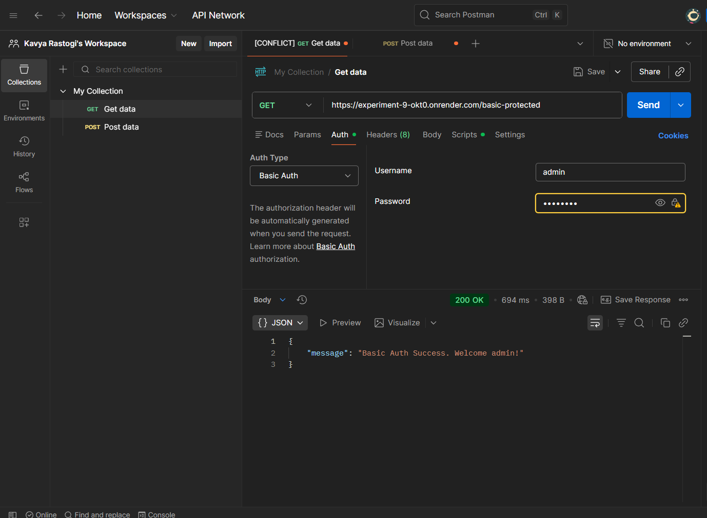
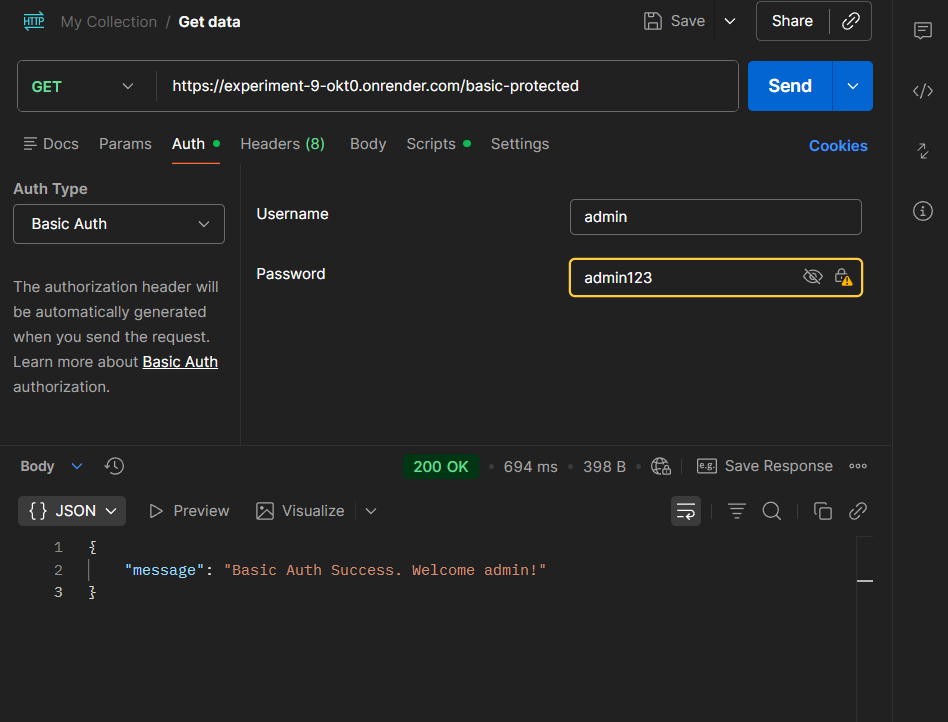
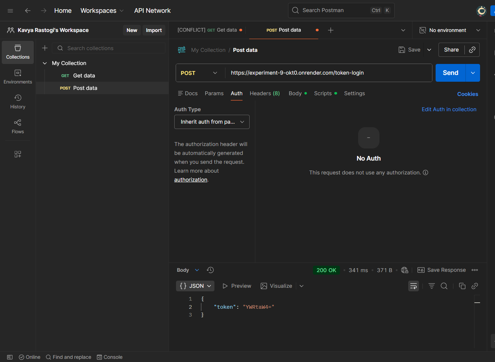

Learning Outcomes

Understand the concept of authentication in web applications.

Learn how to implement Basic Authentication using Authorization headers in Flask.

Implement Token-based authentication using custom headers.

Generate and validate JWT (JSON Web Tokens) for secure API access.

Gain hands-on experience in testing REST APIs using Postman.

Learn how to deploy a Flask application on the Render cloud platform.

Understand how different authentication mechanisms protect API endpoints.

## API Testing Screenshots

### Home Route

### Basic Authentication

### Token / JWT Request
